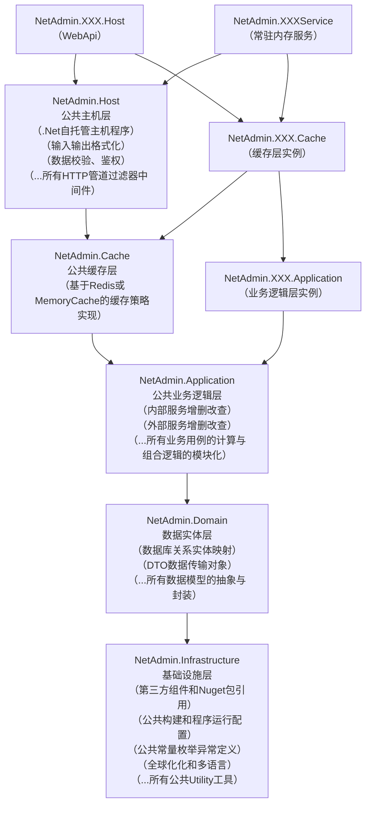

<div style="display: flex;margin-bottom:2rem">
    
  <span style="font-size:4rem;line-height:4rem;padding-left:1rem">
    NetAdmin
  </span>
</div>

[](https://github.com/nsnail/NetAdmin/actions/workflows/dotnet.yml)
[](https://github.com/nsnail/NetAdmin/blob/main/LICENSE)


## 快速开始

```shell
docker run nsnail2/netadmin
```

## 构建步骤

- 后端
    1. 检查dotnet-sdk版本>=8.0.0
   ``` shell
   dotnet --list-sdks

   # 下载 dotnet https://dotnet.microsoft.com/zh-cn/download/dotnet
   ```
    2. 克隆代码仓库
   ``` shell
   git clone https://github.com/nsnail/NetAdmin.git
   cd ./NetAdmin

   # 下载 git https://git-scm.com/downloads
   ```
    3. 确保本机redis处于运行状态
   ``` shell
   redis-cli

   # 下载 redis for windows https://github.com/redis-windows/redis-windows/releases
   # 下载 redis for linux/mac https://redis.io/download
   ```
    4. 运行后端WebApi
   ``` shell
   dotnet run --project ./src/backend/NetAdmin.BizServer.Host/NetAdmin.BizServer.Host.csproj --urls http://[::]:65010
   ```
    5. 体验WebApi程序
        - 浏览器打开 http://localhost:65010 ，将看到Swagger（Knife4jUI）界面

---

- 前端
    1. 检查nodejs版本>=18
   ``` shell
   node -v

   # 下载 nodejs https://nodejs.org/ro/download
   ```
    2. 安装npm依赖包
   ``` shell
   cd ./src/frontend/admin
   npm install
   ```
    3. 运行前端项目
   ``` shell
   npm run dev
   ```
    4. 体验前端程序
        - 浏览器打开 http://localhost:65020 ，将看到管理界面（默认用户名：root，密码：1234qwer）

## 文件目录树

```
+---.template.config         # dotnet 项目模板配置目录
+---assets                   # 程序运行需要的资源文件目录
+---dist                     # 程序编译与分发的二进制文件目录
+---docs                     # 项目文档目录
+---refs                     # 引用的第三方项目仓库目录
+---src                      # 项目源文件目录
```

## 后端项目架构



## 引用的开源代码 / 特别鸣谢

| 语言         | 集成领域          | 开源库                                                                                                                                                                                                                   |
|------------|---------------|-----------------------------------------------------------------------------------------------------------------------------------------------------------------------------------------------------------------------|
| C#         | Web基础框架       | [ASP.NET Core](https://github.com/dotnet/aspnetcore)                                                                                                                                                                  |
| C#         | 快速开发脚手架       | [Furion](https://gitee.com/dotnetchina/Furion)                                                                                                                                                                        |
| C#         | 数据库关系映射       | [FreeSql](https://github.com/dotnetcore/FreeSql)                                                                                                                                                                      |
| C#         | 代码质量检查        | [Roslynator.Analyzers](https://github.com/josefpihrt/roslynator) \| [SonarAnalyzer.CSharp](https://github.com/SonarSource/sonar-dotnet) \| [StyleCop.Analyzers](https://github.com/DotNetAnalyzers/StyleCopAnalyzers) |
| C#         | 单元测试框架        | [xunit](https://github.com/xunit/xunit)  \| [coverlet.collector](https://github.com/coverlet-coverage/coverlet)                                                                                                       |
| C#         | 分布式锁          | [RedLock.net](https://github.com/samcook/RedLock.net)                                                                                                                                                                 |
| C#         | 控制台终端界面库      | [Spectre.Console](https://github.com/spectreconsole/spectre.console)                                                                                                                                                  |
| C#         | 扩展函数库         | [NSExt](https://github.com/nsnail/ns-ext.git)                                                                                                                                                                         |
| C#         | 图形处理库         | [SixLabors.ImageSharp](https://github.com/SixLabors/ImageSharp)                                                                                                                                                       |
| C#         | 文件对象存储        | [Minio](https://github.com/minio/minio-dotnet)                                                                                                                                                                        |
| C#         | 性能监控采集        | [prometheus-net.AspNetCore](https://github.com/prometheus-net/prometheus-net)                                                                                                                                         |
| C#         | 雪花ID生成器       | [Yitter.IdGenerator](https://github.com/yitter/idgenerator)                                                                                                                                                           |
| C#         | 自动化版本管理       | [MinVer](https://github.com/adamralph/minver)                                                                                                                                                                         |
| C#         | JavaScript引擎  | [MsieJavaScriptEngine](https://github.com/Taritsyn/MsieJavaScriptEngine)                                                                                                                                              |
| C#         | WebApi图形界面    | [IGeekFan.AspNetCore.Knife4jUI](https://github.com/luoyunchong/IGeekFan.AspNetCore.Knife4jUI)                                                                                                                         |
| TypeScript | SPA基础框架       | [Vue](https://github.com/vuejs/core)                                                                                                                                                                                  |
| TypeScript | 前端构建工具        | [Vite](https://github.com/vitejs/vite)                                                                                                                                                                                |
| TypeScript | UI控件库         | [Element Plus](https://github.com/element-plus/element-plus)                                                                                                                                                          |
| TypeScript | CSS解析器        | [Sass](https://github.com/sass/sass)                                                                                                                                                                                  |
| TypeScript | 图表和数据可视化      | [ECharts](https://github.com/apache/echarts)                                                                                                                                                                          |
| JavaScript | 后台管理界面        | [SCUI](https://gitee.com/lolicode/scui)                                                                                                                                                                               |
| JavaScript | HTTP请求库       | [Axios](https://github.com/axios/axios)                                                                                                                                                                               |
| JavaScript | JavaScript解析器 | [Terser](https://github.com/terser/terser)                                                                                                                                                                            |
| JavaScript | 代码质量检查        | [ESLint](https://github.com/eslint/eslint)                                                                                                                                                                            |
| JavaScript | 代码格式化工具       | [Prettier](https://github.com/prettier/prettier)                                                                                                                                                                      |
| JavaScript | 标准加密库         | [crypto-js](https://github.com/brix/crypto-js)                                                                                                                                                                        |