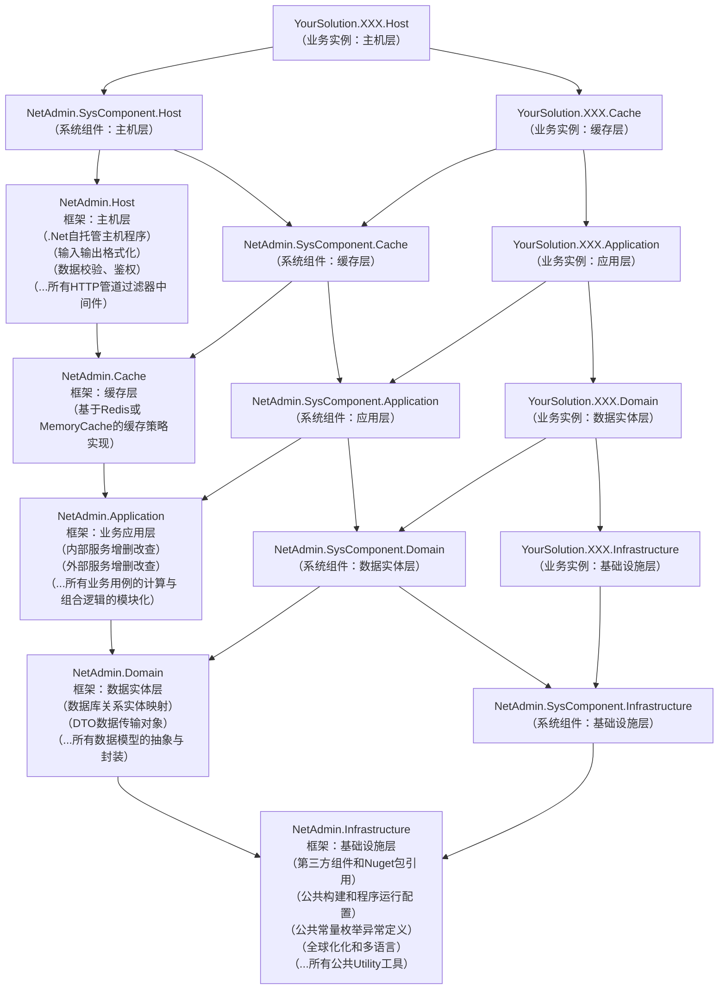

# NetAdmin

通用后台权限管理系统、快速开发框架（基于C#12/.NET9、Vue3/Vite、Element Plus等现代技术构建，具有十分整洁、优雅的编码规范）

[](https://github.com/nsnail/NetAdmin/actions/workflows/nightly-build.yml)
[](https://github.com/nsnail/NetAdmin/blob/main/LICENSE)
[](https://github.com/nsnail/NetAdmin/blob/main/LICENSE)

## 在线预览

https://na.tools92.top

## 一键运行

```shell
docker run -p 8080:8080 nsnail/netadmin
# 需魔法上网
```

## 构建步骤

```shell
# 1. 检查 dotnet sdk 版本 >=9.0.0
dotnet --list-sdks
# 下载 dotnet：https://dotnet.microsoft.com/zh-cn/download/dotnet

# 2. 克隆代码仓库
git clone https://github.com/nsnail/NetAdmin.git && cd ./NetAdmin

# 3. 确认本机 redis 处于运行状态
redis-server # 启动
redis-cli    # 连接测试
# 下载 redis for windows：https://github.com/redis-windows/redis-windows/releases
# 下载 redis for linux/mac：https://redis.io/download

# 4. 运行后端 WebApi
dotnet run --project ./src/backend/NetAdmin.AdmServer.Host/NetAdmin.AdmServer.Host.csproj --urls http://[::]:5010 -is
# -i 插入种子数据
# -s 同步数据库结构
# 浏览器访问 http://localhost:5010 ，将看到Swagger（Knife4jUI）界面

# 5. 检查 nodejs 版本 >=20
node -v
# 下载 nodejs：https://nodejs.org/en/download

# 6. 安装 npm 依赖包
cd ./src/frontend/admin && npm install

# 7. 运行前端项目
npm run dev
# 浏览器访问 http://localhost:5020 ，将看到管理界面（默认用户名密码：root 1234qwer）
```

## 文件目录

```
+---.github                  # github 工程文件目录
+---.template.config         # dotnet 项目模板配置目录
+---assets                   # 项目资源文件目录
+---build                    # 构建相关的工程文件目录
+---dist                     # 编译生成的二进制文件目录
+---docker                   # docker 镜像构建文件目录
+---docs                     # 项目开发文档目录
+---refs                     # 引用的第三方包的仓库目录
+---scripts                  # 各种工具脚本文件目录
+---src                      # 项目源码文件目录
```

## 项目架构



## 特别鸣谢

| 语言         | 集成领域          | 开源库                                                                                                                                                                                                                   |
|------------|---------------|-----------------------------------------------------------------------------------------------------------------------------------------------------------------------------------------------------------------------|
| C#         | Web基础框架       | [ASP.NET Core](https://github.com/dotnet/aspnetcore)                                                                                                                                                                  |
| C#         | 数据库关系映射       | [FreeSql](https://github.com/dotnetcore/FreeSql)                                                                                                                                                                      |
| C#         | 代码质量检查        | [Roslynator.Analyzers](https://github.com/josefpihrt/roslynator) \| [SonarAnalyzer.CSharp](https://github.com/SonarSource/sonar-dotnet) \| [StyleCop.Analyzers](https://github.com/DotNetAnalyzers/StyleCopAnalyzers) |
| C#         | 单元测试框架        | [xunit](https://github.com/xunit/xunit)  \| [coverlet.collector](https://github.com/coverlet-coverage/coverlet)                                                                                                       |
| C#         | 控制台终端界面库      | [Spectre.Console](https://github.com/spectreconsole/spectre.console)                                                                                                                                                  |
| C#         | 扩展函数库         | [NSExt](https://github.com/nsnail/ns-ext.git)                                                                                                                                                                         |
| C#         | 图形处理库         | [SixLabors.ImageSharp](https://github.com/SixLabors/ImageSharp)                                                                                                                                                       |
| C#         | 文件对象存储        | [Minio](https://github.com/minio/minio-dotnet)                                                                                                                                                                        |
| C#         | 性能监控采集        | [prometheus-net.AspNetCore](https://github.com/prometheus-net/prometheus-net)                                                                                                                                         |
| C#         | 雪花ID生成器       | [Yitter.IdGenerator](https://github.com/yitter/idgenerator)                                                                                                                                                           |
| C#         | 自动化版本管理       | [MinVer](https://github.com/adamralph/minver)                                                                                                                                                                         |
| TypeScript | SPA基础框架       | [Vue](https://github.com/vuejs/core)                                                                                                                                                                                  |
| TypeScript | 前端构建工具        | [Vite](https://github.com/vitejs/vite)                                                                                                                                                                                |
| TypeScript | UI控件库         | [Element Plus](https://github.com/element-plus/element-plus)                                                                                                                                                          |
| TypeScript | CSS解析器        | [Sass](https://github.com/sass/sass)                                                                                                                                                                                  |
| TypeScript | 图表和数据可视化      | [ECharts](https://github.com/apache/echarts)                                                                                                                                                                          |
| JavaScript | 后台管理界面        | [SCUI](https://gitee.com/lolicode/scui)                                                                                                                                                                               |
| JavaScript | HTTP请求库       | [Axios](https://github.com/axios/axios)                                                                                                                                                                               |
| JavaScript | JavaScript解析器 | [Terser](https://github.com/terser/terser)                                                                                                                                                                            |
| JavaScript | 代码质量检查        | [ESLint](https://github.com/eslint/eslint)                                                                                                                                                                            |
| JavaScript | 代码格式化工具       | [Prettier](https://github.com/prettier/prettier)                                                                                                                                                                      |
| JavaScript | 标准加密库         | [crypto-js](https://github.com/brix/crypto-js)                                                                                                                                                                        |