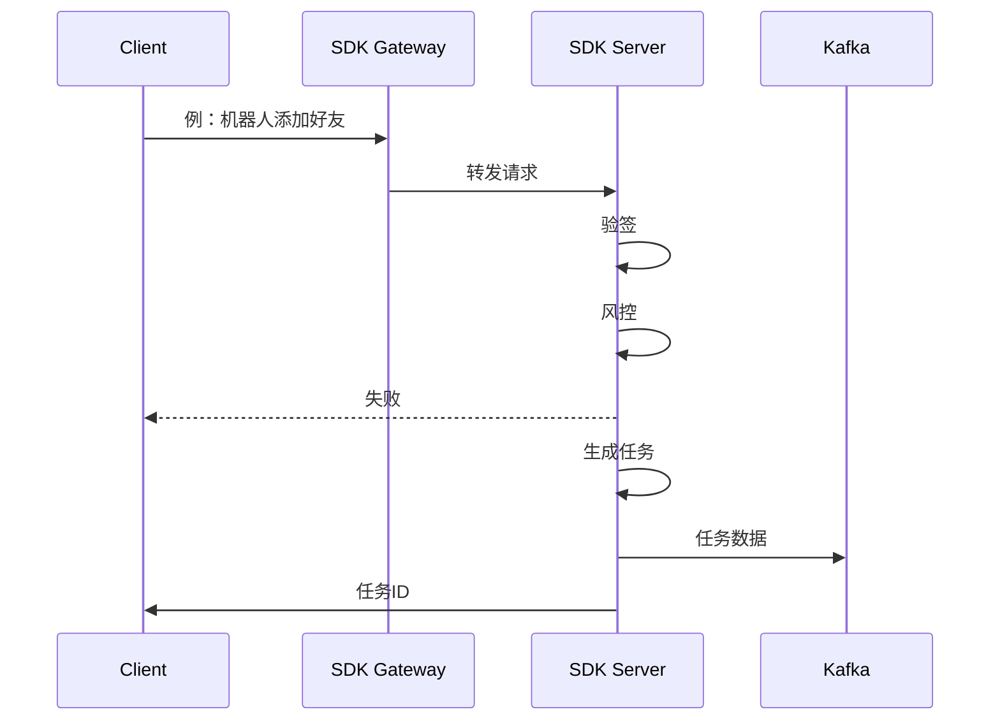
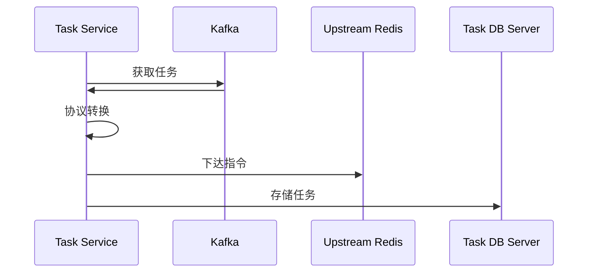
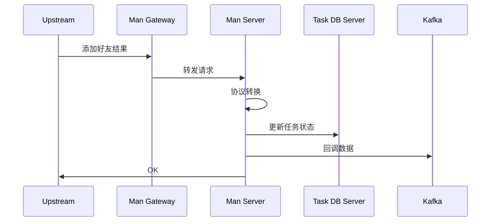
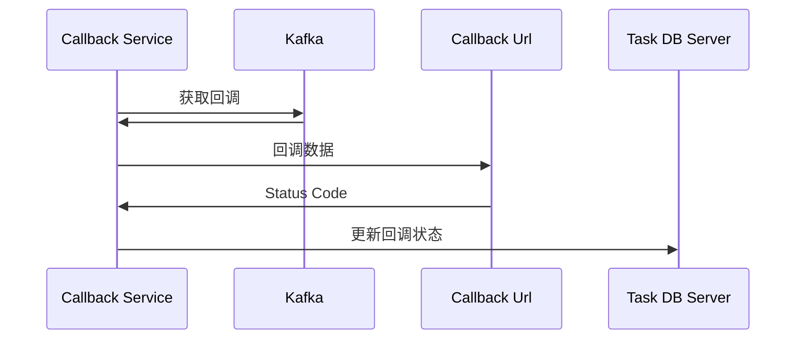

## Line 开放平台 API 请求 - 响应 模型

#### 创建任务

```mermaid
sequenceDiagram
Client ->> SDK Gateway : 例：机器人添加好友
SDK Gateway ->> SDK Server : 转发请求
SDK Server ->> SDK Server : 验签
SDK Server ->> SDK Server : 风控
SDK Server -->> Client : 失败
SDK Server ->> SDK Server : 生成任务
SDK Server ->> Kafka : 任务数据
SDK Server ->> Client : 任务ID
```

#### 执行任务

```mermaid
sequenceDiagram
Task Service ->> Kafka : 获取任务
Kafka ->> Task Service : 
Task Service ->> Task Service : 协议转换
Task Service ->> Upstream Redis : 下达指令
Task Service ->> Task DB Server : 存储任务
```

#### 完成任务

```mermaid
sequenceDiagram
Upstream ->> Man Gateway : 添加好友结果
Man Gateway ->> Man Server : 转发请求
Man Server ->> Man Server : 协议转换
Man Server ->> Task DB Server : 更新任务状态
Man Server ->> Kafka : 回调数据
Man Server ->> Upstream : OK

```

#### 通知结果

```mermaid
sequenceDiagram
Callback Service ->> Kafka : 获取回调
Kafka ->> Callback Service : 
Callback Service ->> Callback Url : 回调数据
Callback Url ->> Callback Service : Status Code
Callback Service ->> Task DB Server : 更新回调状态
```